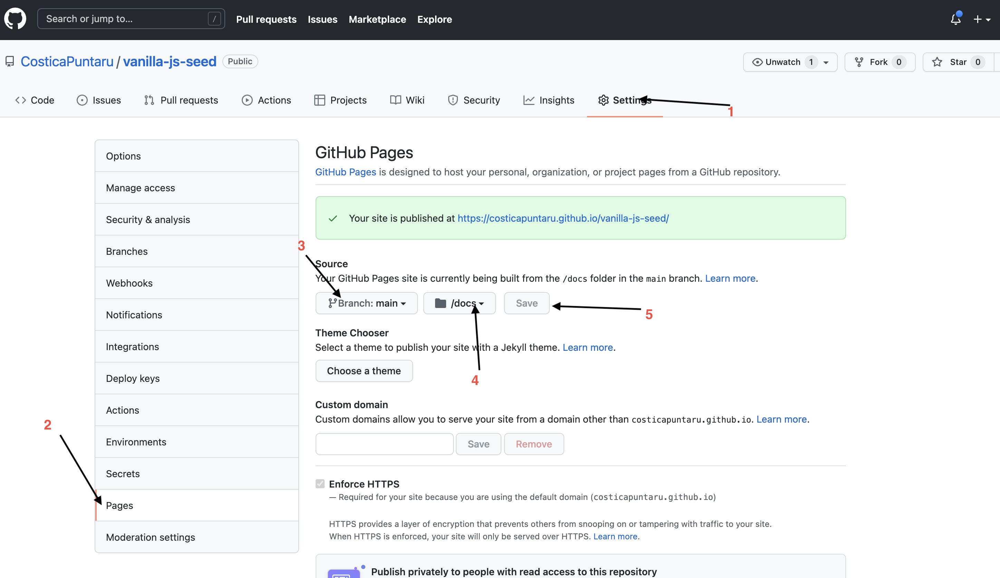

# vanilla-js-seed
***WARNING***: this is a work in progress, for now

## Reasoning
This aims to help new junior/non-developers aspiring to learn javascript/scss/sass.

It aims to give a hassle-free environment to help you focus on your learning instead of getting things to work.

The main reason behind this is to help you make your work public and easy to link in a portfolio with the use of the free github pages feature 

## prerequisites 
1. You need to have node.js installed, you can find the download here: https://nodejs.org/en/
2. You need a github account https://github.com/signup
3. You need to git installed on your computer https://git-scm.com/downloads
4. [optional] setup ssh key to avoid prompt of username and password when using `npm run github` (this only needs to be done once per computer) https://docs.github.com/en/authentication/connecting-to-github-with-ssh keep in mind that the computer that you do this for, will always have rights to change files on all your github repoistory

## Commands

### Make your own copy
Click the big green button "Use this template" on https://github.com/CosticaPuntaru/vanilla-js-seed and set your project name

### Cloning the repository
On your github repository click the green button `code` and copy the url

in a directory run `git clone <paste the url>`

open the newly created folder with the repository name in your favorite editor 

Open a terminal in the editor and run `npm install`

### Starting local environment
`npm run start`

### Publishing all the changes to github pages
`npm run github`

## Working at your projects
Limitations:
* you are not allowed to move/rename the files `/src/js/main.js` and `/src/styles/main.scss`
* you should not mess around with the `webpack.config.js`
* you should not mess around with devDependencies of `package.json`

Notes:
* All feature js features should work out of the box ex. async 
* Please use https://github.com/CosticaPuntaru/vanilla-js-seed/issues to report issue
* If you need help you can find us on our discord server: https://discord.gg/sCM5HqAf
* Pull requests with features and bugfixes are encouraged 

## Enabling github pages for your project

After you click save, or whenever you use `git push` or `npm run github` 
it may take some time to see the changes in the provided ulr

Use the link provided after hitting save to brag about your awesome work!

