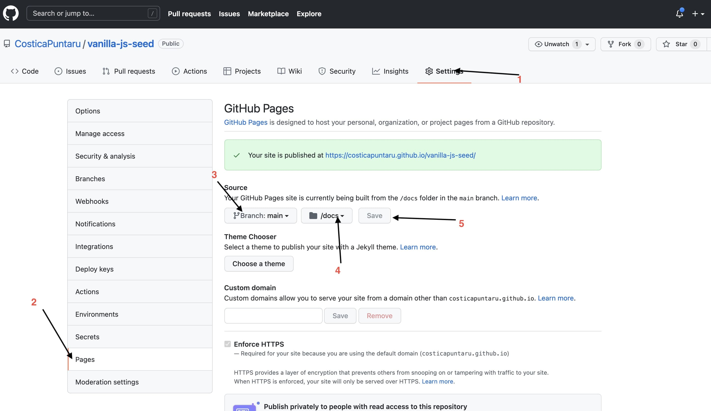

# vanilla-js-scss-seed-project

***WARNING***: this is a work in progress, for now. We are planning to update some dependencies and improve some static files in the near future. Suggestions are welcome!

## Why does this project repository exist?

This aims to help new juniors and non-developers, who are aspiring to learn JavaScript, HTML and CSS plus SCSS/SASS. We are attempting to provide a good start at doing that.

The project aims to provide a hassle-free environment to help you focus on your learning instead of just getting things to work. And by "things", we mean: autorefresh, resource bundling and GitHub-friendly deploy setup.

The main reason behind this is to help you make your work public and easy to link in a portfolio with the use of the free [GitHub Pages](https://pages.github.com/) feature.

## Prerequisites

1. You need to have node.js installed, you can find the download here: https://nodejs.org/en/
2. You need a github account: https://github.com/signup
3. You need to git installed on your computer: https://git-scm.com/downloads
4. [optional] Setup a SSH key to avoid prompt of username and password when using `npm run github` (this only needs to be done once per computer) https://docs.github.com/en/authentication/connecting-to-github-with-ssh – keep in mind that the computer that you do this for will always have rights to change files on all your GitHub repoistory.


## Commands

### Make your own copy

Click the big green button "Use this template" on https://github.com/Cariera-in-IT/vanila-js-scss-seed-project and set your project name

### Cloning the repository

1. On your github repository click the green button `code` and copy the url
2. In a directory, run `git clone <paste the url>`
3. Open the newly created folder with the repository name in your favorite editor
4. Open a terminal in the editor and run `npm install`

### Starting local environment

`npm run start`

### Publishing all the changes to github pages

`npm run github`

## Working on your project

### Limitations

* you are not allowed to move/rename the files `/src/js/main.js` and `/src/styles/main.scss`
* you should not mess around with the `webpack.config.js`
* you should not mess around with devDependencies of `package.json`

### Notes

* All JavaScript features should work out of the box, for example: async, hot reload, etc.
* You can make your life easier when working with favicons, by generating them via https://realfavicongenerator.net/ and overwriting all files in the `/src` folder root so it matches the branding you want for your project.
* Please use https://github.com/Cariera-in-IT/vanila-js-scss-seed-project/issues to report issues with this project.
* If you need help you can find us on our Discord server: https://discord.gg/UpnAutz
* Pull requests with features and bugfixes are highly encouraged.

### Variables you need to change

There are a number of variables hard coded in the text files in this project with a dollar sign `$` prefix. If you search and replace all of them, it will help you easily standardize everything. Here is a full list of variables you need to change, with a description for each:

| Variable | Definition |
| --- | --- |
| `$site_name` | The actual name of your project, website or portfolio item. |
| `$site_domain` | The domain name of your deployed website. E.g. `viorelmocanu.ro` or `link-in-bio-umber.vercel.app`. |
| `$language_short` | The short version of the language your project is in. For example: `en` or `ro`. This uses the [ISO 639-1](https://en.wikipedia.org/wiki/List_of_ISO_639-1_codes) standardization. |
| `$language_long` | The longer version of the language your project is in. It includes the specific region of the language variant, for example: `en-GB` (English spoken in Great Britain) or `ro-RO` (Romanian spoken in Romania). Make use of [this table](https://lingohub.com/developers/supported-locales/language-designators-with-regions) to sort out the correct code you want to use. |
| `$color_theme` | The color in extended hexadecimal format (e.g. `#bada55`) that is categorized as the "main color" of the branding of the project you're building. For example, `#4F6DF5` is the branding color of the **Carieră în IT** logo you can see above. |
| `$og_image` | The Open Graph image is a 1200x630px image you should generate to allow your page to have the most impact when being shared across social media and chat software. |
| `$og_alt` | The alternate text of the OpenGraph image, usually a combination of your `$site_name` and tagline. |
| `$facebook_appid` | An optional Facebook application ID you can generate when you develop Facebook apps. |
| `$twitter_account` | An optional Twitter account handle you can connect the current website with. E.g. `@ViorelMocanu`. |
| `$site_email` | An optional email address you want to use for people to contact the website owner or a support person or yourself. |
| `$site_telephone` | An optional telephone number you want to use for people to contact the website owner or a support person or yourself. You should use the international format: `+ country_code actualphonenumber` e.g. `+40700000000` |
| `$page_title` | The meta title of the current page. According to SEO standards, it should be less than 50-60 characters or to be more precise, 600px in width when displayed in a Google SERP. |
| `$page_description` | The meta description of the current page. According to SEO standards, it should be less than 150-160 characters. |
| `$page_url` | This is the URL of the current page when deployed to a live server (using GitHub Pages, Vercel, Netlify or some other service). It should be the full URL, not a relative one. |
| `$page_date` | The date and time your page was published, in ISO format (yyyy-mm-ddThh:mm:ss - yes, there is a "T" between the date and the time), for example: `2022-01-16T20:00:00`. |
| `$webfont_url` | The optional relative location of the webfont you want to preload, if you are using a webfont other than the default provided with the operating system. |

## Enabling github pages for your project



* After you click save, or whenever you use `git push` or `npm run github`.
* It may take some time to see the changes in the provided URL.
* Use the link provided after hitting save to brag about your awesome work! *(and get an interview in that hiring process)*

## Errors and workarounds

### Child compilation failed error

The project is built on the premise that all files you reference in your HTML, CSS and JS files are there, so it will help by displaying an error similar to this one when something goes missing:

```console
Error: Child compilation failed:
  Module not found: Error: Can't resolve '/favicon-32x32.png' in 'G:\VueJS Work\vanila-js-scss-seed-project\src'
  ModuleNotFoundError: Module not found: Error: Can't resolve '/favicon-32x32.png' in 'G:\VueJS Work\vanila-js-scss-seed-project\src'
```

When this happens, make sure the file it's looking for is there. If it isn't put it there. If you can't, replace it or remove its reference from the code.

### Compiled with problems

When seeing this issue, you probably either "misplaced" some SCSS you referenced with the `@import` command, like the example below, or you generated a compilation error in the SCSS itself.

```console
Compiled with problems:X

ERROR in ./styles/main.scss (./styles/main.scss.webpack[javascript/auto]!=!../node_modules/css-loader/dist/cjs.js!../node_modules/sass-loader/dist/cjs.js!./styles/main.scss)

Module build failed (from ../node_modules/sass-loader/dist/cjs.js):
SassError: Can't find stylesheet to import.
  ╷
3 │ @import "reset";
  │         ^^^^^^^
  ╵
  src\styles\main.scss 3:9  root stylesheet
```

Please follow the advice in the error to fix your problem.
